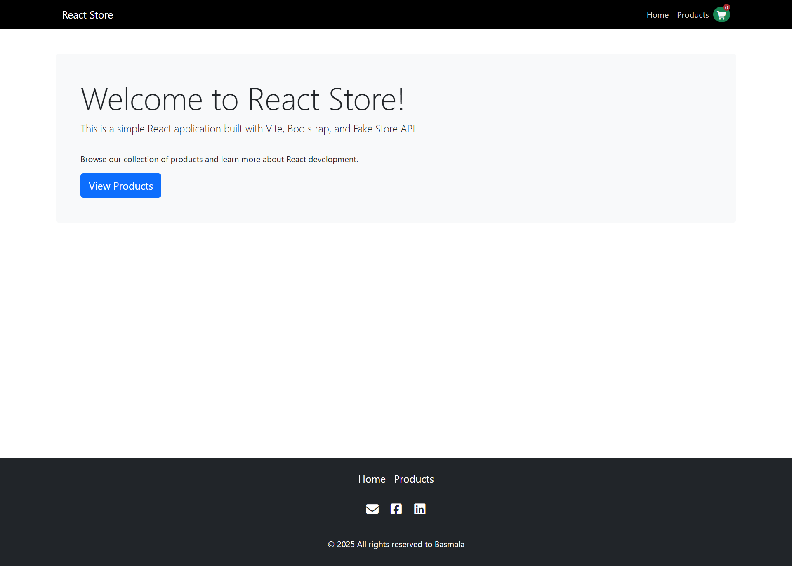
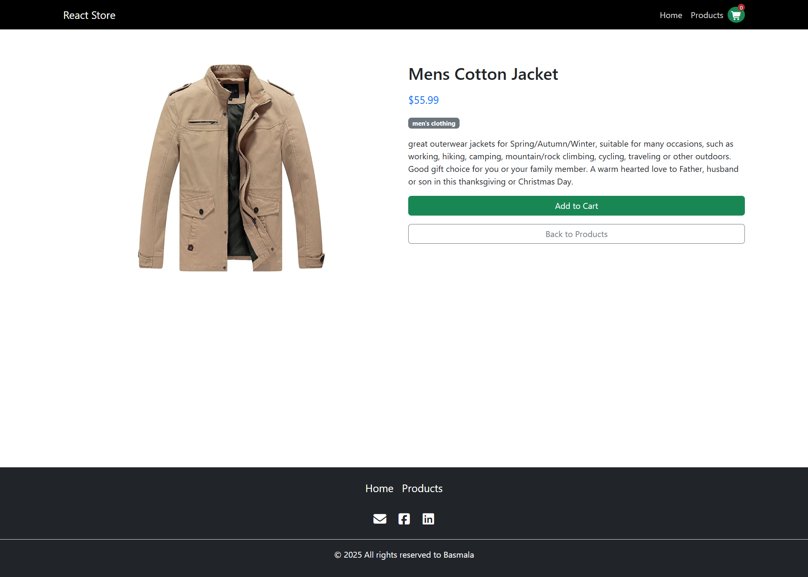

# React-Store
A website for selling products created using React.
Provides a fast and responsive interactive interface for browsing products from the Fake Store API
## Features
- **Responsive design** : It works on all mobile and desktop devices
- **Product catalogue** : Browse all products with photo previews
- **Product Details** : View information about each product
- **Modern UI** : A structured user interface created using Bootstrap
- **Fast loading** : Improved performance using Vite build tool
## Technologies Used
### Front end
- **React 19**: The latest version of the popular JavaScript library for building user interfaces
- **React Router 7**: To handle navigation and routing within the application
- **Bootstrap 5**: for responsive design 
- **Font Awesome**: Provides new icons, styles and improvements!
- **Axios**: To make HTTP requests to the API.
### Development tools
- **Vite**: Front-end tools for faster development and improved builds
- **npm**: Package manager for JavaScript
## Start

### Basic requirements
- Node.js (version 18 or higher)
- npm (version 7 or higher)
### Installation

1. Clone the repository
```bash
git clone https://github.com/username/repo-name.git
cd react-store
```

2. Install dependencies
```bash
npm install
```

3. Start server
```bash
npm run dev
```

4. Open your browser and navigate to `http://localhost:5173`

## Project Structure
├── public/              # Public assets
├── src/                 # Source files
│   ├── assets/          # Static assets
│   ├── components/      # Reusable components
│   ├── App.jsx          # Main application component
│   ├── App.css          # Application styles
│   ├── index.css        # Global styles
│   └── main.jsx         # Entry point
├── .gitignore           # Git ignore file
├── eslint.config.js     # ESLint configuration
├── index.html           # HTML template
├── package.json         # Project dependencies and scripts
├── README.md            # Project documentation
└── vite.config.js       # Vite configuration

## Acknowledgements
- [Fake Store API](https://fakestoreapi.com/) for providing the product data
- [React](https://reactjs.org/) for the amazing library
- [Vite](https://vitejs.dev/) for the blazing fast build tool
- [Bootstrap](https://getbootstrap.com/) for the responsive design framework
- [Font Awesome](https://fontawesome.com/) New icons, styles and improvements!

# React + Vite

This template provides a minimal setup to get React working in Vite with HMR and some ESLint rules.

Currently, two official plugins are available:

- [@vitejs/plugin-react](https://github.com/vitejs/vite-plugin-react/blob/main/packages/plugin-react) uses [Babel](https://babeljs.io/) for Fast Refresh
- [@vitejs/plugin-react-swc](https://github.com/vitejs/vite-plugin-react/blob/main/packages/plugin-react-swc) uses [SWC](https://swc.rs/) for Fast Refresh

## Expanding the ESLint configuration

If you are developing a production application, we recommend using TypeScript with type-aware lint rules enabled. Check out the [TS template](https://github.com/vitejs/vite/tree/main/packages/create-vite/template-react-ts) for information on how to integrate TypeScript and [`typescript-eslint`](https://typescript-eslint.io) in your project.

## Screenshots




